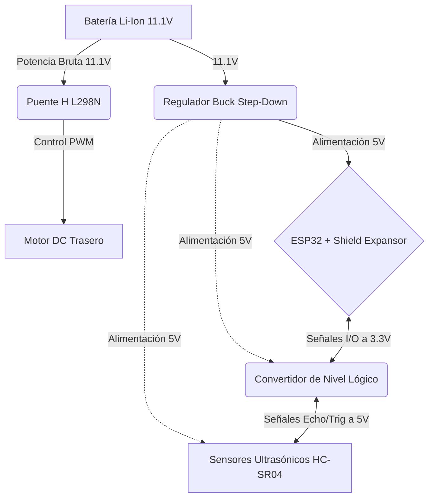

# 🚀 WRO 2026 Future Engineers: Equipo Cayapa - Robot "Dinoco"

<p align="center">
  
</p>

> *Vehículo autónomo de diseño compacto desarrollado por el equipo **Cayapa** para competir en la categoría Future Engineers de la World Robot Olympiad (WRO) 2026. Diseñado para optimizar el radio de giro, la estabilidad estructural y la velocidad de procesamiento mediante un microcontrolador ESP32 y una matriz de sensores ultrasónicos.*

---

## 📌 ÍNDICE
1. Introducción y Datos del Equipo
2. Evolución e Iteraciones del Diseño Mecánico
   - 2.1 Prototipo 1.0 (Arduino Mega & Chasis RC)
   - 2.2 Dinoco 2.0 (Diseño Compacto & ESP32)
3. Movilidad y Sistema de Tracción/Dirección
4. Arquitectura de Hardware, Sensores y Energía
5. Dimensiones de la Pista y Estrategia de Control
6. Análisis de Fallas, Riesgos y Lecciones Aprendidas
7. Guía de Reproducibilidad y Archivos del Repositorio

---

## 👥 1. Introducción y Datos del Equipo

Este repositorio documenta el desarrollo integral de nuestro vehículo autónomo **"Dinoco"**. Como estudiantes de Ingeniería en Electrónica, aplicamos principios de control automático, diseño mecánico e integración de sistemas electromecánicos para cumplir con la normativa oficial de la WRO 2026.

### Miembros del Equipo
* **Leontino Jose Medina Di Donato** - *Desarrollo de Software y Algoritmos de Control*
* **Adriana Carolina Palmar Molero** - *Diseño de Circuitos, Sistema de Potencia y Cableado*
* **Nilecto Noe Leon Guerere** - *Diseño Mecánico, Modelado e Impresión 3D*

---

## 🔄 2. Evolución e Iteraciones del Diseño Mecánico

El desarrollo de *Dinoco* ha sido un proceso estrictamente iterativo, donde cada modificación respondió a fallas diagnosticadas durante pruebas dinámicas en pista.

### 2.1. Prototipo 1.0: Chasis RC Modificado y Arquitectura Basada en Arduino Mega

#### 📐 Motivación y Selección Mecánica Inicial
Debido a las restricciones de tiempo en la fase inicial del proyecto, el equipo optó por no diseñar un chasis desde cero. En su lugar, se seleccionó como plataforma de pruebas un chasis comercial de radiocontrol (RC) de dimensiones iniciales de **45 cm de largo por 20 cm de ancho**. Para adecuarlo al reglamento, se redujo la longitud recortando la estructura central.

* **Sistema de Tracción:** Transmisión por eje posterior rígido hacia ambas ruedas traseras.
* **Sistema de Dirección:** Servomotor **MG995**, seleccionado por su elevado par de apriete (torque).

#### 🔌 Arquitectura Electrónica y Sistema de Alimentación
* **Procesamiento:** Microcontrolador **Arduino Mega**.
* **Alimentación y Regulación:** Fuente de 12V con puente H para el motor principal y regulador lineal **LM7805** para alimentar a 5V la matriz de tres sensores ultrasónicos (HC-SR04).

#### 🔬 Diagnóstico Crítico de Fallas (¿Por qué falló el Prototipo 1.0?)
1. **Radio de Giro Ineficiente:** Con dimensiones cercanas al límite máximo, el vehículo requería un radio de viraje sumamente amplio, siendo incapaz de completar curvas de 90° cerradas o ejecutar el estacionamiento autónomo.
2. **Ruido Inductivo (Back-EMF):** El servomotor MG995 inyectaba picos de corriente hacia el pin de señal del Arduino Mega, provocando bloqueos aleatorios del programa.
3. **Sobrecarga Térmica y Caídas de Tensión (Brownouts):** El regulador LM7805 sufría sobrecalentamiento por la demanda simultánea de los sensores y el servo, ocasionando lecturas erráticas y reinicios constantes.

---

### 2.2. Dinoco (Versión 2.0 / Actual): Optimización Dimensional y Upgrade Electrónico

Tras analizar las limitaciones mecánicas y eléctricas del Prototipo 1.0, rediseñamos la plataforma desde cero para crear **Dinoco 2.0**, enfocándonos en la ergonomía, la velocidad de procesamiento y la modularidad.

| Vista del Chasis Actual | Ensamblaje de Componentes |
| :---: | :---: |
|  |  |

#### 📏 Reducción Ergonométrica de Dimensiones
* **Longitud Reducida:** Pasó de 45 cm a una longitud compacta entre **23 cm y 25 cm**.
* **Ancho Reducido:** Se optimizó a **15 cm de ancho**.
* **Beneficio en Pista:** Esta disminución drástica del volumen mejora significativamente la maniobrabilidad del robot dentro de los carriles de la pista, permitiéndole trazar curvas cerradas a mayor velocidad sin riesgo de colisión lateral.

#### ⚙️ Reutilización del Tren Motriz y Dirección Simplificada con Rodamientos
* **Transmisión Trasera:** Se optó por mantener la motorización DC Makeblock sobre eje rígido. Se descartó la implementación de un sistema diferencial impreso en 3D debido al alto costo en tiempo de modelado, ajuste y adaptación mecánica, priorizando la confiabilidad del conjunto.
* **Sistema de Dirección Ackermann:** Se rediseñó el tren delantero integrando **rodamientos (rolineras)** en los manguetas de dirección. Esto reduce drásticamente la fricción mecánica, elimina el juego holgado y permite que un servomotor más liviano mantenga un control angular preciso.

#### 🧠 Migración al Microcontrolador ESP32 + Shield Expansor
* **Capacidad de Cómputo:** Reemplazamos el Arduino Mega por un **ESP32**, aprovechando su arquitectura Dual-Core a 240 MHz, mayor memoria RAM y buffers de comunicación más amplios para el procesamiento del algoritmo PID.
* **Módulo Shield Expansor (Base Board):** Montamos el ESP32 sobre una placa de expansión de pines. Esto organiza el cableado, mejora la disipación térmica y facilita las labores de mantenimiento o sustitución rápida de componentes durante la competencia.

---

## ⚙️ 3. Movilidad y Sistema de Tracción/Dirección

### 3.1. Tracción Trasera: Motor DC Makeblock 9V (185 RPM)


* **Justificación de Selección:** Proporciona un **alto par motor (torque)** gracias a su caja reductora metálica, manteniendo constante la tracción de las ruedas traseras.
* **Control de Velocidad:** Gobernado a través de señales PWM mediante el controlador Puente H L298N.

### 3.2. Dirección delantera tipo Ackermann con Rodamientos


* **Mecanismo:** Geometría Ackermann equipada con **rodamientos (rolineras)** en los puntos de pivote para minimizar el rozamiento.
* **Actuador:** Servomotor **MG90S con engranajes metálicos**, evitando desgastes por colisión y garantizando un ángulo de giro suave y rápido.

<div style="clear: both;"></div>

---

## 🔌 4. Arquitectura de Hardware, Sensores y Energía

Para el diseño de **Dinoco 2.0**, realizamos una reestructuración completa de los componentes electrónicos y electromecánicos. Evaluamos las fallas del prototipo anterior y seleccionamos cuidadosamente cada pieza basándonos en un análisis de compensaciones (*Trade-offs*).

### Diagrama de Flujo de Energía y Datos



### 4.1. Unidad de Procesamiento Central (Cerebro)

#### ESP32 (Placa de Desarrollo 30 Pines)

* **Función y Ubicación:** Es el cerebro del robot, encargado de ejecutar el control PID y procesar los sensores. Va ubicado en la parte superior del chasis para evitar interferencias.
* **Por qué se cambió:** Reemplaza al Arduino Mega del Prototipo 1.0. El Mega era muy lento (16 MHz) y grande. El ESP32 nos da procesamiento Dual-Core a 240 MHz, permitiendo cálculos de trayectoria casi instantáneos.
* **Ventajas:** Alta velocidad de reloj, conectividad inalámbrica para futura telemetría y tamaño sumamente compacto.
* **Desventajas:** Opera con lógica de 3.3V (a diferencia de los 5V del Arduino), lo que nos obligó a rediseñar la electrónica de sensores para evitar quemar sus pines.

#### Shield Expansor para ESP32 (30 Pines)

* **Función y Ubicación:** Base donde se acopla el ESP32, expandiendo sus pines GPIO a borneras y conectores macho.
* **Por qué se implementó:** En el carro anterior, las conexiones directas o en protoboard generaban falsos contactos con las vibraciones.
* **Ventajas:** Facilita el cableado con terminales Dupont, organiza la distribución de energía y permite sustituir el ESP32 en segundos en caso de falla en los pits.
* **Desventajas:** Aumenta ligeramente la altura de la electrónica principal.

### 4.2. Adaptación y Regulación de Energía

#### Conversor de Nivel Lógico (Level Shifter Bidireccional)

* **Función y Ubicación:** Interfaz colocada entre los sensores ultrasónicos y el ESP32.
* **Por qué se implementó:** El ESP32 solo soporta 3.3V en sus entradas, pero el pin Echo de los sensores ultrasónicos envía pulsos de 5V. 
* **Ventajas:** Protege los pines GPIO del microcontrolador de sobretensiones irreversibles, traduciendo de 5V a 3.3V y viceversa de forma segura.
* **Desventajas:** Añade complejidad al cableado del esquemático y requiere ser alimentado con ambos voltajes (High y Low) simultáneamente.

#### Regulador de Voltaje LM2596 (Buck Converter / Step-Down)

* **Función y Ubicación:** Reduce el voltaje de las baterías (11.1V) a un bus estable y seguro de 5V para la lógica y sensores.
* **Por qué se cambió:** Reemplaza al regulador lineal LM7805 del Prototipo 1.0. El 7805 disipaba la energía sobrante como calor, sobrecalentándose y apagando el robot.
* **Ventajas:** Al ser un regulador conmutado, tiene una eficiencia de hasta 92%, no se sobrecalienta fácilmente y permite ajustar el voltaje de salida con precisión mediante un potenciómetro.
* **Desventajas:** Puede introducir un leve ruido de conmutación de alta frecuencia en la línea de alimentación.

#### Baterías 18650 (x3) y Portabaterías (Holder)

* **Función y Ubicación:** Fuente de energía principal. Alojadas en la parte inferior trasera del chasis para mantener el centro de gravedad bajo.
* **Por qué se eligieron:** Proveen **11.1V nominales** conectados en serie. Su alta capacidad de descarga soporta los picos de arranque del motor trasero sin causar reinicios (brownouts) en el procesador.
* **Ventajas:** Recargables, altísima densidad energética y mantienen un voltaje estable por más tiempo.
* **Desventajas:** Requieren un cargador especializado y balanceo de celdas; un cortocircuito puede ser peligroso.

### 4.3. Actuadores y Mecánica de Tracción

#### Motor DC Makeblock 9V (185 RPM) y Puente H L298N

* **Función y Ubicación:** El motor provee la tracción en el eje trasero sólido. El driver L298N controla su sentido de giro y velocidad mediante PWM.
* **Por qué se conservaron:** Fueron las únicas piezas reutilizadas del Prototipo 1.0. Desarrollar un diferencial desde cero exigía un tiempo del que no disponíamos, y este motor demostró ser totalmente capaz.
* **Ventajas:** La caja reductora del motor ofrece excelente torque. El driver L298N es robusto, tiene disipador térmico y aísla el ruido del motor de la placa lógica.
* **Desventajas:** El eje rígido obliga a un ligero arrastre de las ruedas traseras en curvas cerradas. El L298N tiene una caída de voltaje interna que resta un poco de eficiencia.

#### Servomotor MG90S

* **Función y Ubicación:** Controla la geometría de dirección Ackermann en el tren delantero.
* **Por qué se cambió:** Reemplaza al MG995. El antiguo servo era innecesariamente grande, pesado y generaba un rebote eléctrico (Back-EMF) que colgaba al microcontrolador. 
* **Ventajas:** Formato miniatura que ahorra espacio, pero con **engranajes metálicos (Metal Gear)** que garantizan durabilidad frente a golpes contra las paredes.
* **Desventajas:** Menor torque bruto en comparación con el MG995, pero se compensó aliviando la mecánica de la dirección.

#### Rodamientos (Rolineras) 608 y 687ZZ

* **Función y Ubicación:** Instalados en los ejes y articulaciones (manguetas) del sistema de dirección impreso en 3D.
* **Por qué se implementaron:** El Prototipo 1.0 usaba fricción directa plástico con plástico, lo que hacía que el giro fuera tosco y forzaba el servomotor.
* **Ventajas:** Reducen la fricción a casi cero, mejoran drásticamente la suavidad del giro, otorgan mayor precisión para el retorno al centro y alargan la vida útil del MG90S.
* **Desventajas:** Requieren tolerancias de impresión 3D extremadamente precisas (ajuste de interferencia) para que no queden con juego ni sueltos.

### 4.4. Sensores de Entorno

#### Matriz de Sensores Ultrasónicos HC-SR04 (x3)

* **Función y Ubicación:** Sistema de detección primario. Uno frontal para detectar esquinas/muros finales y dos laterales para el control PID de seguimiento de carril.
* **Por qué se conservaron:** A pesar del ruido que presentan, con los algoritmos de filtrado correctos aplicados ahora en el ESP32, son suficientes para la navegación reactiva.
* **Ventajas:** Económicos, fáciles de reemplazar y cubren perfectamente el rango de medición que requiere una pista de 3x3 metros.
* **Desventajas:** Sonido divergente (el haz se ensancha y puede rebotar mal si el carro choca en ángulo). Para el futuro de la competencia, se planea integrar una cámara para solventar esta limitación.

---

## 🎯 5. Dimensiones de la Pista y Estrategia de Control

El diseño de *Dinoco 2.0* se adaptó estrictamente a las especificaciones del campo de juego descritas en el reglamento oficial de la WRO 2026 Futuros Ingenieros:

### 📐 Especificaciones de la Pista (Reglamento WRO)
* **Área Total del Campo:** 3000 mm x 3000 mm (3 m x 3 m).
* **Ancho de Carril:** Carriles de circulación delimitados por paredes exteriores e interiores con secciones de entre 400 mm y 500 mm.
* **Zonas de Salida y Estacionamiento:** Secciones marcadas en la pista donde el vehículo debe iniciar de forma autónoma y realizar la maniobra de parqueo en paralelo o batería al finalizar las vueltas de la prueba.

### 💻 Algoritmo de Control PID Adaptado
Heredamos y refinamos el algoritmo de **Control Proporcional-Integrativo-Derivativo (PID)** del software anterior:

1. **Lectura y Filtrado:** El ESP32 consulta cíclicamente los sensores ultrasónicos a través del convertidor de nivel lógico, aplicando un filtro por media móvil para eliminar picos erróneos.
2. **Cálculo de Error de Centrado:** Se determina la diferencia de distancia entre la pared izquierda y derecha: `Error = Distancia Izquierda - Distancia Derecha`.
3. **Corrección Angular:** La salida del PID ajusta en tiempo real la señal PWM hacia el servomotor de dirección, permitiendo que *Dinoco 2.0* navegue suavemente centrado en el carril y realice giros fluidos en las esquinas de la pista.

---

## 🧠 6. Análisis de Fallas, Riesgos y Lecciones Aprendidas

En esta sección documentamos los problemas técnicos encontrados durante la fase de desarrollo y las soluciones de ingeniería implementadas:

> ⚡ **Problema: Caídas de voltaje (Brownouts) al arrancar el motor**
> * **Causa:** El motor DC exigía un pico de corriente al arrancar que bajaba la tensión del bus principal por debajo de 3.3V, reiniciando el microcontrolador.
> * **Solución de Ingeniería:** Separamos las líneas de alimentación implementando el LM2596 y añadimos condensadores de desacoplo, asegurando que la fluctuación del motor no afecte al ESP32.

> 🔊 **Problema: Lecturas erráticas en los sensores ultrasónicos**
> * **Causa:** El ruido acústico del aire y la vibración estructural generaban picos de lectura falsos (distancias de 0 cm o >400 cm).
> * **Solución de Ingeniería:** Diseñamos una función de software que toma muestras consecutivas, descarta los valores extremos y calcula un promedio antes de enviar la señal al control de dirección.

> ⚠️ **Desajuste de Niveles de Voltaje (3.3V vs 5V):**
> * **Riesgo:** Conectar las salidas Echo de los sensores (5V) directamente al ESP32 (3.3V) dañaría progresivamente los puertos GPIO.
> * **Solución:** Implementación obligatoria del módulo convertidor de nivel lógico bidireccional entre la matriz de sensores y el Shield del ESP32.

---

## 🛠️ 7. Guía de Reproducibilidad y Archivos del Repositorio

El repositorio está estructurado para asegurar la total reproducibilidad del robot:

```text
├── src/            # Código fuente (.ino) optimizado para ESP32
├── models/         # Piezas STL para la dirección Ackermann con rodamientos y soportes 3D
├── schematics/     # Diagrama de conexiones con convertidor de nivel lógico y Buck Converter
└── docs/           # Reglamento WRO 2026 y datasheets de componentes
```
