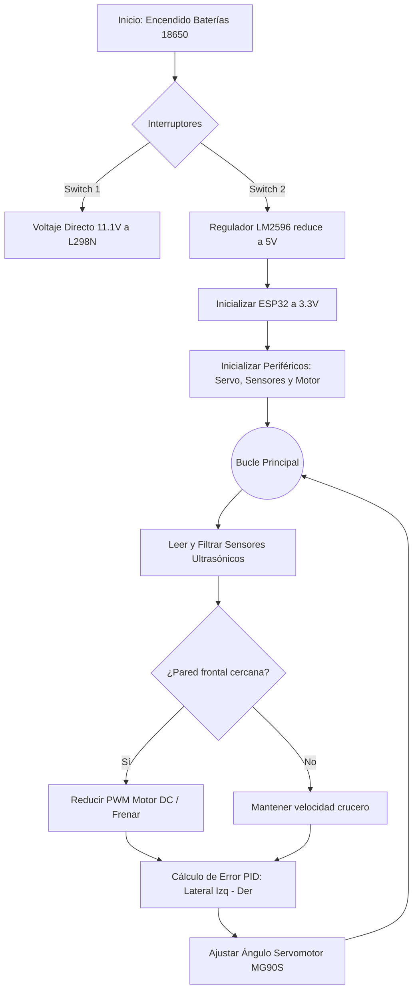

## **Diagrama Electrico**

## Diagrama de Flujo del CircuitoEste documento presenta un diagrama de flujo que ilustra la lógica operativa de un circuito, basado en la imagen de referencia proporcionada.

**Explicación Detallada del Diagrama de Flujo**:El diagrama de flujo desglosa los pasos inferidos del funcionamiento del circuito:Inicio:Representa el punto de partida para la secuencia de operaciones del circuito.

Este apartado detalla la secuencia operativa del circuito integrado del vehículo autónomo, reflejando la transición hacia el procesamiento avanzado del ESP32 y el control PID.

### Explicación Detallada del Flujo:

* **Inicio y Encendido (Gestión de Energía):** Representa el punto de partida. El sistema se alimenta de un paquete de 3 baterías 18650 (11.1V). La energía se distribuye a través de dos interruptores: uno dirige el voltaje crudo al módulo de potencia L298N para máxima tracción, y el otro hacia el regulador de voltaje LM2596.
* **Acondicionamiento de Voltaje (Buck Converter):** El módulo LM2596 reduce y estabiliza los 11.1V a un bus seguro de 5V para alimentar los sensores, el servomotor y la placa de expansión.
* **Inicialización del Microcontrolador (ESP32):** El procesador arranca y configura sus pines GPIO. Como opera con lógica de 3.3V, se establece la comunicación segura con los sensores (que operan a 5V) a través del conversor de nivel lógico bidireccional.
* **Inicialización de Periféricos:** Los sensores ultrasónicos HC-SR04 se preparan para emitir pulsos. El servomotor MG90S se calibra en su punto muerto central (dirección recta) y el controlador L298N se habilita para gestionar el motor DC de tracción.
* **Bucle Principal (Control de Navegación):** El programa entra en un ciclo de ejecución continuo, vital para la autonomía del vehículo.
* **Lectura y Filtrado de Sensores:** Se consultan los sensores frontal y laterales. Se aplica un filtro de media móvil por software para descartar picos de ruido acústico o lecturas falsas.
* **Evaluación de Entorno (Algoritmo PID):** 
  * **Cálculo de Error:** El ESP32 calcula la diferencia de distancias laterales para determinar la desviación del centro del carril ($Error = Distancia Izquierda - Distancia Derecha$).
  * **Corrección de Trayectoria:** La salida del algoritmo PID ajusta dinámicamente el ángulo del servomotor (geometría Ackermann) para recentrar el vehículo.
  * **Control de Velocidad:** Si el sensor frontal detecta una pared o esquina próxima, se reduce la señal PWM enviada al motor DC para maniobrar de forma segura; si el camino está libre, se mantiene la velocidad de crucero.
* **Retorno del Bucle:** El sistema regresa inmediatamente al paso de lectura de sensores, garantizando una alta frecuencia de muestreo y correcciones en tiempo real.

### 📊 Representación Visual

